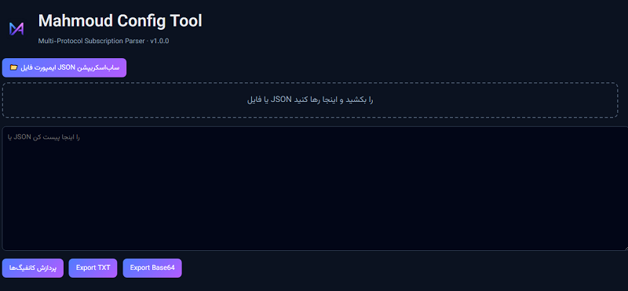
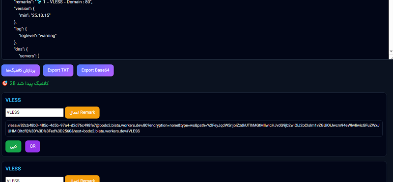

# mahmoud-config-tool
Multi-Protocol Subscription Parser (VLESS / VMESS / TROJAN)

https://cavalier-king.github.io/mahmoud-config-tool/       لینک ابزار 

✨ توضیح ابزار

زمانی که یک لینک ساب‌اسکریپشن در اختیار دارید، معمولاً تعداد زیادی کانفیگ مختلف داخل آن وجود دارد. در این میان، برخی از کانفیگ‌ها ممکن است غیرفعال یا غیرقابل استفاده باشند و باعث شلوغی و سردرگمی در اپلیکیشن شما شوند.

با استفاده از این ابزار، می‌توانید کانفیگ‌ها را تفکیک کرده و فقط تعداد مورد نیاز و قابل استفاده‌ی خود را انتخاب و استفاده کنید.

روش استفاده بسیار ساده است:

کافی است لینک ساب‌اسکریپشن را در مرورگر باز کرده و فایل JSON را کپی کرده و داخل ابزار قرار دهید

یا اگر فایل JSON را روی کامپیوتر دارید، با استفاده از دکمه ایمپورت فایل JSON آن را وارد کنید

همچنین امکان Drag & Drop (کشیدن و رها کردن فایل) نیز پشتیبانی می‌شود

پس از وارد کردن اطلاعات، تنها با کلیک روی دکمه پردازش کانفیگ‌ها، تمام کانفیگ‌ها به‌صورت جداگانه پردازش می‌شوند.

در نهایت:

هر کانفیگ به‌صورت مستقل در اختیار شما قرار می‌گیرد

امکان کپی مستقیم کانفیگ‌ها وجود دارد

همچنین می‌توانید از QR Code برای اضافه‌کردن سریع به اپلیکیشن‌ها استفاده کنید

یکی دیگر از قابلیت‌های مهم این ابزار، امکان تغییر و ساده‌سازی Remark‌ها (نام‌های طولانی و نامنظم کانفیگ‌ها) است؛ به‌طوری که می‌توانید هر نام دلخواهی را جایگزین آن‌ها کنید و لیست کانفیگ‌های مرتب و خوانا داشته باشید.

✨ Tool Description (English)

When you have a subscription link, it usually contains a large number of configurations. Among them, some configs may be inactive or non-working, which can clutter your application and make management difficult.

This tool helps you separate and organize configurations, allowing you to select only the number of working configs you need and use them efficiently.

The usage is very simple:

Open your subscription link in a browser and copy the JSON content into the tool

Or, if you already have the JSON file on your computer, you can import it using the JSON import button

You can also use Drag & Drop to upload the JSON file easily

After providing the data, simply click the Process Configs button to parse all configurations.

Once processed:

Each configuration is displayed individually

You can copy configs directly

You can also use QR Codes to quickly import them into your client apps

Another important feature of this tool is the ability to rename long or messy remarks. You can replace them with any custom name you prefer, resulting in a clean and well-organized list of configurations.

## 📸 Screenshots

